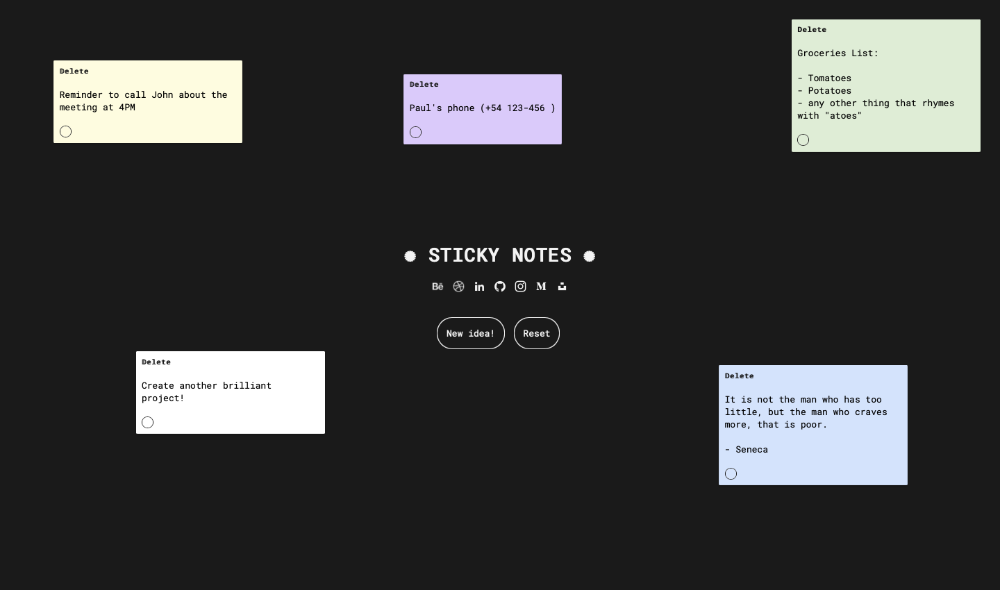

  
  

          
<h3>✺ Sticky Note Website ✺</h3>

The Sticky Note Website is a web application developed using HTML, CSS, and JavaScript. It provides a digital version of sticky notes, allowing users to create and organize virtual notes for various purposes.

<h4>✹ Goal ✹</h4>

The main objective of the Sticky Note Website is to offer a virtual platform for users to create and manage digital sticky notes. The goal is to provide a user-friendly interface that mimics the experience of physical sticky notes while offering additional features and convenience.

<h4>✹ Design ✹</h4>

The Sticky Note Website features a visually appealing design inspired by real-life sticky notes. The interface incorporates vibrant colors and textures to create a playful and engaging user experience. The notes are designed to resemble physical sticky notes, complete with draggable functionality for easy repositioning.

<h4>✹ Features ✹</h4>

  

* <b>Create Sticky Notes:</b> Users can create new sticky notes by simply clicking on a "New Note" button. Each note can contain text, allowing users to jot down reminders, ideas, or any other information.
* <b>Color Picker:</b> Users can change the color background of any note, just clicking on the color picker below the notes.
* <b>Drag and Drop:</b> The sticky notes are draggable, allowing users to rearrange them on the virtual canvas. This feature enables flexible organization and customization.
* <b>Edit and Delete:</b> Users can easily edit the content of a sticky note by clicking on it. Additionally, a delete option is available to remove unwanted notes from the canvas.
* <b>Save and Load:</b> The website provides the ability to save the sticky notes locally or on a server, allowing users to retrieve their notes even after closing the browser or refreshing the page.
* <b>Responsive Design:</b> The website is designed to be responsive, ensuring a seamless user experience across different devices and screen sizes.

<h4>✹ What I've Learned ✹</h4>

* <b>DOM Manipulation:</b> Developing the Sticky Note Website helped me enhance my skills in manipulating the Document Object Model (DOM) using JavaScript. I learned how to dynamically create, update, and remove elements to build interactive interfaces.
* <b>Event Handling:</b> Through the project, I gained experience in handling user interactions and responding to events such as clicks and drags, enabling a smooth and intuitive sticky note experience.
* <b>Data Persistence:</b> I learned how to utilize local storage or server-side storage to save and load data, allowing users to access their sticky notes across sessions.

<h4>✹ Link to the Project ✹</h4>

<h5>https://bypedroneres.github.io/Sticky-Notes/</h5>

<h4>✹ Thanks for your interest! ✹</h4>

Feel free to explore the Sticky Note Website and enjoy the convenience of virtual sticky notes. Whether you use them for personal organization or collaborative brainstorming, I hope this tool brings value to your digital workspace. If you have any feedback or suggestions, please don't hesitate to reach out. Happy note-taking!
